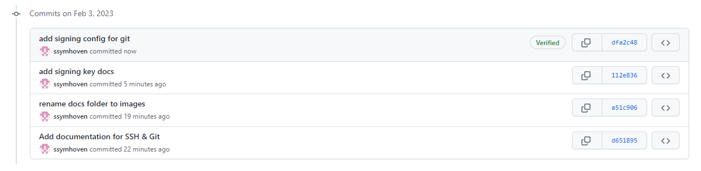

<p align="center">
    
</p>

# Getting Started

## Table of Content

1. [SSH](#ssh)
   1. [Create new SSH key](#create-new-ssh-key)
   2. [Add public key to GitHub](#add-public-key-to-github)
   3. [GPG signing](#gpg-signing)
2. [Git & Gitflow](#git--gitflow)
   1. [Overview](#overview)
   2. [Default Operations](#default-operations)
3. [Install Python](#install-python)

## SSH

You can access and write data in repositories on GitHub using SSH (Secure Shell Protocol). When you connect via SSH, 
you authenticate using a private key file on your local machine instead of a password.

### Create new SSH key

To add a new SSH keypair to your local machine, open a terminal, paste the text below,  
substituting in your GitHub email address:

```commandline
ssh-keygen -t ed25519 -C "ssymhoven@donner-reuschel.lu"
```

When you're prompted to "Enter a file in which to save the key", you can press Enter to accept the default file location.
At the prompt, type a secure passphrase, just press Enter and confirm the passphrase again with Enter. 

It should look like this at the end:


### Add public key to GitHub

Then open [GitHub](https://github.com/settings/ssh) and select "New SSH Key". 

Choose a title, select the key type as "Authentication Key" and copy the content of the generated 
public SSH key (*.pub) to the field "Key". Make sure the public key ends with your email address entered in 
`ssh-keygen` command.

Submit with "Add SSH key":


### GPG signing

You can also add the same public key again with type "Signing Key" to sign your commits. 
To configure git commit signing on all repositories, open a command prompt run the following:

```commandline
git config --global commit.gpgsign true
git config --global gpg.format ssh
git config --global user.signingkey "C:\Users\<username>\.ssh\<keyname>.pub"
```

Now your commits should be verified by GitHub:



## Git & Gitflow

Git is the most used and powerful among the Version Control Systems. 

### Overview

Git branch is an important 
of all the set of changes that you have made in the code base. In easy words, GIT branch is the 
local copy of the main codebase which will have the changes of the new feature or bug fix, 
which will later be merged with the main codebase once after verified.


Each git repository has a central repository. Central repositories are often created through 3rd party 
Git hosting services like GitHub. Each developer creates a local copy of the entire project.


### Default Operations 


#### Clone central repository

```commandline
git clone ssh://user@host/path/to/repo.git              # Clone the central repository
```

#### Create new branch

```commandline
git branch <branch-name>                                 # Create a new branch 
```

#### Checkout a branch

```commandline
git checkout <branch-name>                              # Checkout existing branch
git checkout -b <branch-name>                           # Create a new branch and check it out
```

#### Make changes and commit

```commandline
git status                                              # View the state of the repo
git add <some-file>                                     # Stage a file
git commit -m "commit message"                          # Commit a file</some-file>
```

With `git add .` you can add all changes.

##### Push changes to central repository

```commandline
git push <remote> <branch>                             # Push <branch> to <remote>
git push origin master                                 # Push master to origin
```

If you push your local branch the first time to the central repository, you have to set an upstream remote branch:

```commandline
git push --set-upstream-to <remote> <remote-branch>    # set upstream of current branch to <remote-branch> at <remote>
git push --set-upstream-to origin my-awesome-feature   # set upstream of current branch to my-awesome-feature at origin
```

## Install Python

Download [Python 3.9.13](https://www.python.org/ftp/python/3.9.13/python-3.9.13-amd64.exe)-Installer and install it for
your user. Make sure you select `Add to PATH` before installing it. 

Then you can add a new virtual environment in PyCharm based on your Python executable installed in 
`C:\Users\<username>\AppData\Local\Programs\Python\Python39\python.exe`
